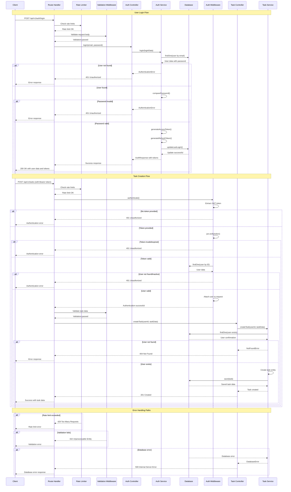

# API Sequential Flow Diagram

## User Login → Create Task Flow

This document provides a visual representation of the complete flow from user authentication to task creation, including all system components and their interactions.

### Flow Overview

The diagram below illustrates the sequential flow of a user logging in and then creating a task, showing the interaction between:
- **Client**: Frontend application or API consumer
- **Route**: Express.js route handlers
- **Middleware**: Authentication, validation, and other middleware
- **Controller**: Business logic controllers
- **Service**: Service layer for business operations
- **Database**: PostgreSQL database operations

### Mermaid Diagram

### Flow Components Explanation

#### 1. Client Layer
- **Responsibility**: Initiates API requests
- **Authentication**: Stores and sends JWT tokens
- **Error Handling**: Processes API responses and errors

#### 2. Route Handler Layer
- **Responsibility**: HTTP request routing and response formatting
- **Middleware Integration**: Applies middleware in correct order
- **Response Management**: Formats and sends HTTP responses

#### 3. Middleware Layer

##### Rate Limiter Middleware
- **Purpose**: Prevents API abuse
- **Implementation**: IP-based request counting
- **Configuration**: Different limits for auth vs general endpoints

##### Validation Middleware
- **Purpose**: Validates request data structure and content
- **Implementation**: Joi schema validation
- **Error Response**: Detailed validation error messages

##### Authentication Middleware
- **Purpose**: Verifies user identity and authorization
- **Token Processing**: JWT extraction, verification, and user lookup
- **Request Enhancement**: Attaches user data to request object

#### 4. Controller Layer
- **Responsibility**: Orchestrates business logic
- **Error Handling**: Catches and formats service layer errors
- **Response Formatting**: Structures API responses consistently

#### 5. Service Layer
- **Responsibility**: Implements core business logic
- **Database Interaction**: Manages data persistence operations
- **Business Rules**: Enforces application-specific rules and validations

#### 6. Database Layer
- **Responsibility**: Data persistence and retrieval
- **Query Execution**: Handles SQL operations through TypeORM
- **Data Integrity**: Maintains referential integrity and constraints

### Error Handling Flows

#### Authentication Errors
1. **Missing Token**: 401 Unauthorized immediately
2. **Invalid Token**: JWT verification fails → 401 Unauthorized
3. **Expired Token**: JWT expiration check fails → 401 Unauthorized
4. **User Not Found**: Database lookup fails → 401 Unauthorized
5. **Inactive User**: User status check fails → 401 Unauthorized

#### Validation Errors
1. **Schema Validation**: Joi validation fails → 422 Unprocessable Entity
2. **Type Validation**: Data type mismatch → 422 Unprocessable Entity
3. **Business Rule Validation**: Service layer validation → 400 Bad Request

#### Database Errors
1. **Connection Error**: Database unavailable → 503 Service Unavailable
2. **Constraint Violation**: Unique constraint fails → 409 Conflict
3. **Query Error**: SQL execution fails → 500 Internal Server Error

#### Rate Limiting Errors
1. **General Rate Limit**: Too many requests → 429 Too Many Requests
2. **Auth Rate Limit**: Too many auth attempts → 429 Too Many Requests

### Performance Considerations

#### Database Optimization
- **Indexes**: Strategic indexing on frequently queried fields
- **Query Optimization**: Efficient query patterns using TypeORM
- **Connection Pooling**: Managed database connections

#### Caching Strategy
- **JWT Verification**: Token validation caching (future enhancement)
- **User Data**: User information caching (future enhancement)
- **Rate Limiting**: In-memory rate limit counters

#### Response Time Targets
- **Authentication**: < 200ms
- **Task Creation**: < 150ms
- **Task Retrieval**: < 100ms

### Security Measures

#### Token Security
- **Secure Storage**: Client-side secure token storage
- **Token Rotation**: Refresh token mechanism
- **Expiration**: Short-lived access tokens

#### Request Security
- **HTTPS Only**: Encrypted communication in production
- **CORS Protection**: Configured allowed origins
- **Security Headers**: Helmet.js security headers

#### Data Protection
- **Password Hashing**: bcrypt with salt rounds
- **Input Sanitization**: Joi validation and sanitization
- **SQL Injection Prevention**: Parameterized queries via TypeORM

This sequential flow ensures secure, validated, and efficient processing of user requests while maintaining system integrity and performance.
